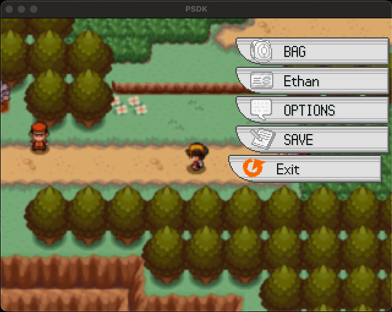

# Main Menu



The Main Menu, also known as Menu allows the player to access various interfaces.

By default, this UI only shows which interface the player can use. In the previous screenshot, you can see that the dex and party are absent from the Menu because the player has no creatures and has no Dex.

## How to open the menu

In game, you should press V (physical key for X).

In scripts, you should call [`GamePlay.open_menu`](../scripts/4%20Systems/000%20General/100%20GamePlay.rb). The Menu respects the [`MenuMixin`](../scripts/4%20Systems/100%20Menu/099%20MenuMixin.rb) which defines the `execute_skill_process` function that `Scene_Map` needs to ensure that moves can be executed properly.

If you want to change the Main Menu that PSDK uses for your own fully home made Menu, please assign [`GamePlay.menu_class`](../scripts/4%20Systems/000%20General/100%20GamePlay.rb) to the class of your own Menu. Please, also make sure that your Menu class respects the [`MenuMixin`](../scripts/4%20Systems/100%20Menu/099%20MenuMixin.rb).

## How to add a button

To add an option you need to call `GamePlay::Menu.register_button`.

For example:

```ruby
GamePlay::Menu.register_button(:open_party) { $actors.any? }
```

In this code, we're registering the menu option that opens the party under the condition that the party is not empty (by calling `open_party` which is defined in [`GamePlay::Menu`](../scripts/4%20Systems/100%20Menu/100%20Menu.rb) and checking non-emptyness of party with `$actors.any?`).

> [!IMPORTANT]  
> The quit button is always pushed at the end (based on `:open_quit` action)

## How to register a button overwrite

A button overwrite allows you to render the button completely differently than regular buttons. For example, `UI::GirlBagMenuButton` is using the 8th slice of the `menu_icons` instead of using the 3rd one.

You can edit many behaviour (such as displayed text or the overall look of the button).

To ensure the the Main Menu picks the right overwrite, you need to define it.

For example:

```ruby
GamePlay::Menu.register_button_overwrite(2) { $trainer.playing_girl ? UI::GirlBagMenuButton : nil }
```

This overwrite will use `UI::GirlBagMenuButton` for the 2nd menu button if the player is playing girl. Otherwise, it'll use the default one (`nil`).

> [!NOTE]  
> Button index might change based on what's available to the player, `register_button_overwrite` uses the `real_index`.  
> The `real_index` is used for text and icon purpose, `positional_index` is used for position purpose, see [UI::PSDKMenuButtonBase](../scripts/4%20Systems/100%20Menu/300%20MenuButtonBase.rb)

## How to add a new button text

If you want to add a new button text, you must patch the method `text` of [UI::PSDKMenuButtonBase](../scripts/4%20Systems/100%20Menu/300%20MenuButtonBase.rb).

You can alternatively [register a button overwrite](#how-to-register-a-button-overwrite).

## How to setup a custom button order

If you don't want to go by the PSDK button order, you can call `GamePlay::Menu.clear_previous_registers` and then register all the button in your way.

Here's the default PSDK button registration:

```ruby
module GamePlay
  # Main menu UI
  class Menu
    register_button(:open_dex) { $game_switches[Yuki::Sw::Pokedex] }
    register_button(:open_party) { $actors.any? }
    register_button(:open_bag) { !$bag.locked }
    register_button(:open_tcard) { true }
    register_button(:open_option) { true }
    register_button(:open_save) { !$game_system.save_disabled }
    register_button(:open_quit) { true }

    register_button_overwrite(2) { $trainer.playing_girl ? UI::GirlBagMenuButton : nil }
  end
end
```

> [!WARNING]  
> Custom order might cause confusing display of buttons. You should fix the `menu_icons` file and `text` function of [UI::PSDKMenuButtonBase](../scripts/4%20Systems/100%20Menu/300%20MenuButtonBase.rb)
